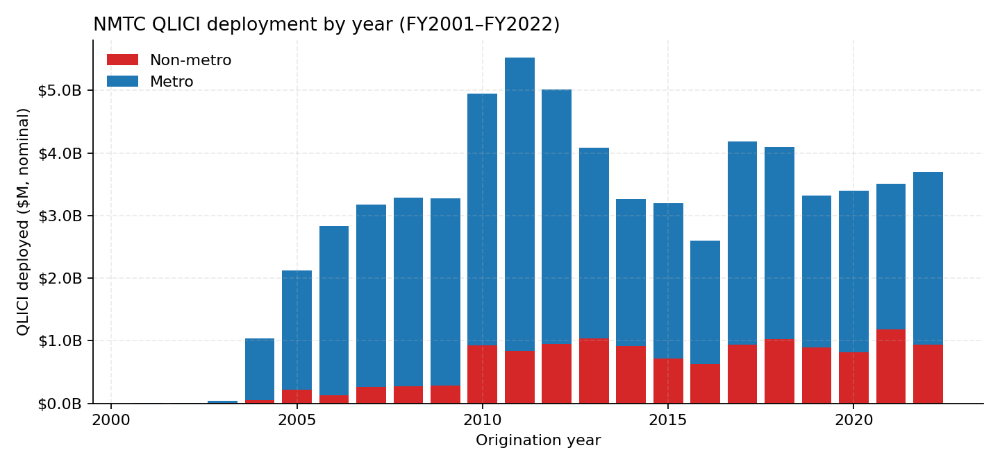
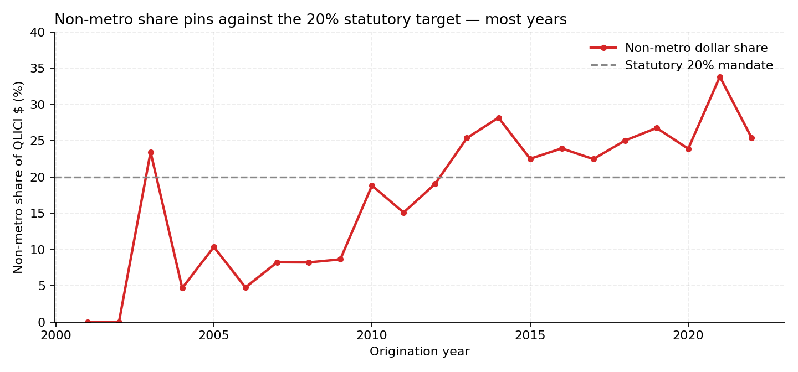
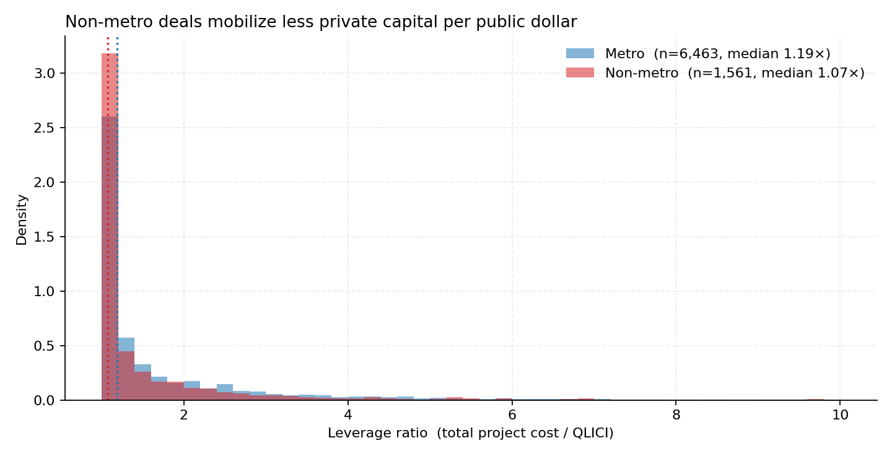
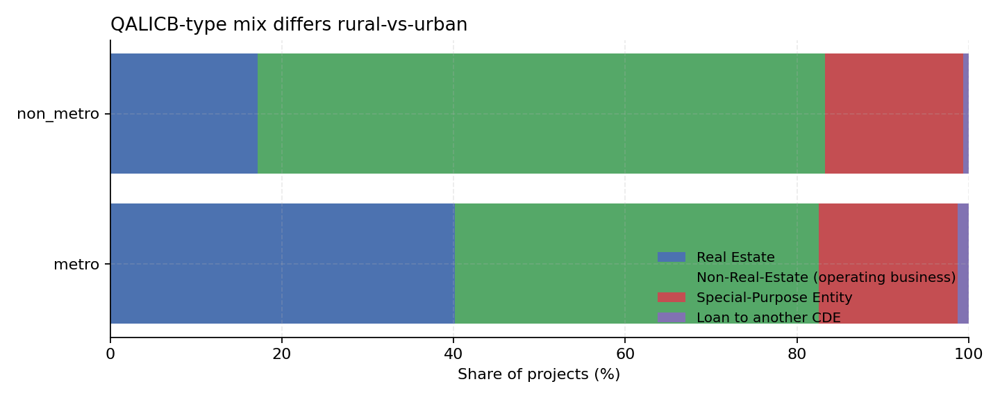
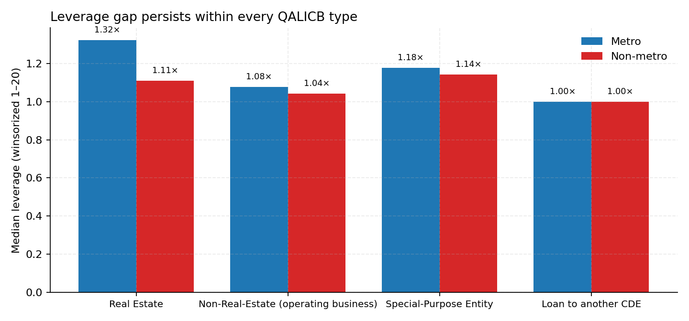

The empirical fact this paper exists to explain is visible before any
regression. This chapter walks through six figures and one summary
table that establish the rural mobilization gap as real, persistent
across project types, and tied to enormous heterogeneity in CDE-level
deployment behavior.

## Headline numbers

| metric | value |
|---|---:|
| Total QLICI deployed, FY2001–FY2022 | \$66.6 billion |
| Total project cost (public + private combined) | \$120.9 billion |
| **Implied program-wide mobilization ratio** | **0.82×** |
| Number of QLICI transactions | 19,907 |
| Number of unique projects | 8,024 |
| Number of unique CDEs | ~600 |
| Number of unique census tracts | ~6,500 |
| Non-metro share of dollars | 19.6% |
| Non-metro share of transactions | 19.3% |
| Statutory non-metro target | 20.0% |

For every \$1 of federal credit deployed, the program pulled in
approximately \$0.82 of additional non-federal capital. That's the
program-wide blended-finance number. It implies the federal credit is
roughly 55% of total project cost on average — a program designed to
*catalyze* private investment is being only barely matched dollar-for-
dollar by private capital. **NMTC is closer to a direct grant than a
high-leverage instrument.**

## The metro-vs-non-metro split

| | metro | non-metro |
|---|---:|---:|
| Number of projects | 6,463 | 1,561 |
| Total QLICI deployed | \$53.6 B | \$13.0 B |
| Total project cost | \$97.2 B | \$23.8 B |
| **Mean leverage** | **1.99×** | **1.73×** |
| **Median leverage** | **1.19×** | **1.07×** |
| Mobilization ratio (aggregate) | 0.81× | 0.82× |

Two things to highlight:

1. **The aggregate mobilization ratios are nearly identical**
   (0.81× metro vs 0.82× non-metro) — what CDFI tells the world. The
   aggregate hides the median story.
2. **The median leverage gap is real**: 1.19× metro versus 1.07× non-
   metro. The right tail of leverage is long; the median is more
   informative than the mean. **The typical rural deal mobilizes
   essentially zero additional private capital** (1.07× is just barely
   above the 1× floor).

## Annual deployment

{#fig-annual width=95% fig-cap-location=bottom}

The program ramped from almost nothing in 2001 to roughly \$5 billion
per year through the 2010s, then settled into a \$3–4 billion annual
steady state. The non-metro share (red base of each bar) is visibly
present every year.

## Non-metro share over time

{#fig-share width=95%}

The non-metro share *hovers above* the 20% target in most years —
suggesting CDEs in aggregate over-perform the floor — and dips slightly
below it in only a few. The line and the floor are tightly co-moving,
which is the descriptive signature of a binding constraint.

## The leverage distribution

{#fig-leverage width=95%}

This is the empirical fact the rest of the paper is built around:

- **Both distributions have a heavy mass at leverage = 1×** — the floor
  meaning 100% NMTC-financed, zero private capital mobilized.
- **The non-metro mass at the floor is substantially higher** than
  metro. Rural deals very disproportionately do not mobilize any
  additional private capital.
- **Both have long right tails**, but metro has a noticeably fatter
  right shoulder (more deals at 1.5×, 2×, 3×). Metro deals more often
  stack additional private capital on top.

Median: 1.19× metro vs 1.07× non-metro, gap = 0.12.
Mean: 1.99× vs 1.73×, gap = 0.26.

## QALICB-type composition differs by metro status

{#fig-types width=95%}

A natural objection: maybe the rural leverage gap is just a project-
type composition story. Real-estate deals leverage more than operating-
business deals (you can stack mezzanine debt, second mortgages, etc.),
and rural skews toward operating businesses. Maybe the metro-vs-non-
metro gap is really an RE-vs-NRE gap.

This is the *correct* objection. We address it directly:

## The gap holds within every QALICB type

{#fig-within width=95%}

| within QALICB type | metro median | non-metro median |
|---|---:|---:|
| Real estate (RE) | 1.32× | 1.11× |
| Non-real-estate (NRE) | 1.08× | 1.04× |
| Special-purpose (SPE) | 1.18× | 1.14× |
| Loan-to-CDE | 1.00× | 1.00× |

**The gap is real and it is not composition.**

## CDE-level heterogeneity is enormous

The top-20 CDEs together do roughly 50% of all NMTC dollars. Their
non-metro shares span from approximately 0% to 80%:

| CDE | total \$M | non-metro share |
|---|---:|---:|
| Rural Development Partners LLC | 636 | **80%** |
| Montana Community Development Corporation | 660 | **70%** |
| Midwest Minnesota Community Development Corporation | 662 | **60%** |
| Coastal Enterprises, Inc. | 679 | 40% |
| Advantage Capital Community Development Fund | 1,439 | 30% |
| Truist Community Development Enterprises | 654 | 20% |
| Stonehenge Community Development | 797 | 20% |
| Chase New Markets Corporation | 717 | 20% |
| USBCDE LLC | 935 | 10% |
| Local Initiatives Support Corporation | 1,123 | 10% |
| ESIC New Markets Partners | 1,057 | **0%** |
| Consortium America LLC | 759 | **0%** |
| Capital Impact Partners | 660 | **0%** |
| National Trust Community Investment Corporation | 657 | **0%** |

Same federal credit. Same statute. Wildly different organizations,
wildly different deployment patterns. **This heterogeneity is the
variation the empirical strategy of [Chapter 5](05-empirical-strategy.qmd)
exploits.**
